# Mise en place d'un portfolio via un fichier README à votre compte  GitHub

L'**I**ntelligence **A**rtificielle **Gén**érative est un outil qui est aujourd'hui inévitable.
Voici l'extrait d'une petite conversation avec **ChatGPT** :

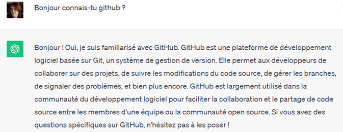

Vous allez donc commencer par créer votre compte GitHub.

Pour cela, rendez-vous sur le site officiel : <https://github.com/>

## 1. Créer un compte Github

Si vous n'avez pas encore de compte github, inscrivez-vous avec votre **adresse email universitaire**, cela vous permettra d'avoir des **avantages** avec le programme Github Education que nous rejoindrons d'ici quelques lignes ;-)


Et laissez-vous guider :

- Votre **email** doit être votre mail universitaire
- Votre **mot de passe** (**password**) doit être correctement sécurisé 😉
- Votre **identifiant** (**username**) ne doit pas être exotique. Une bonne pratique est de choisir comme username l'initiale de votre prénom suivi de votre nom en minuscule : c'est pour cela que mon username est **iblasquez** 😉
- Vous choisissez votre **préférence concernant l'envoi d'éventuelles annonces par mail**
- Vous devez ensuite **résoudre une énigme pour vérifier que vous n'êtes pas un robot**

…. Et il est enfin temps de cliquer sur le bouton **create account**
et de consulter votre **mail universitaire** pour récupérer le **code à saisir** 😉

<!--Comme le montre la copie d'écran ci-dessous, indiquez ensuite que vous êtes **seul** et que vous êtes **étudiant** :

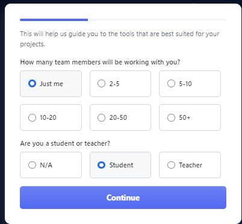

Cochez les **fonctionnalités  (features)** qui vous intéressent  (pourquoi pas toutes les features 😉)

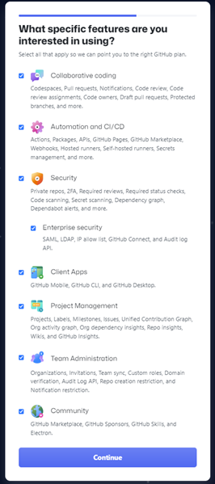

Vous découvrez alors ce que vous permet votre compte Github :

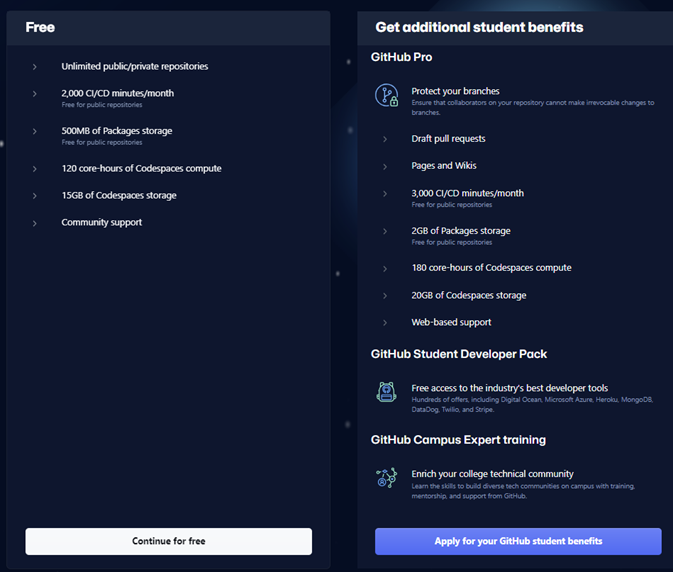

A cette étape-là, il est intéressant de cliquer sur **`Apply for your Github student benefits`**

Vous arrivez sur la page <https://education.github.com/pack>-->


**Une fois le compte créé, cliquez sur le lien suivant :
<https://education.github.com/pack>**

Vous voyez sur cette page tous les outils auxquels vous pourrez avoir accès gratuitement en tant qu'étudiant (et notamment les fameux profuits de la suite JetBrains : IntelliJ pour Java, PhpStorm pour php, ...)

Pour cela il ne vous reste plus qu'à cliquer sur le bouton suivant (**`Sign up for Student Developer Pack`**)

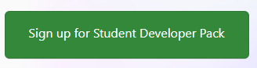

puis


Puis à remplir le formulaire et à cliquer sur continue

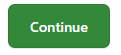

Et continuer à suivre les consignes ...

## 2. Personnaliser le profil de votre compte Github

Maintenant que votre compte github est créé et que vous êtes connecté à votre compte github, vous allez pouvoir personnaliser le **profil de votre compte github** qui n'est autre qu'un **fichier `README`** lié à votre compte.

### 2.a Si vous venez juste de créer votre compte github

Normalement vous êtes connectés, allez simplement sur : <https://github.com/>

Vous rejoignez ainsi votre écran d'accueil (**Home**) qui vous affiche un certain nombre de rubriques et de cadres.

 Dans la rubrique **`Start Writing code`**, cliquez sur le bouton **`Create de l'encart`** suivant :
**`Introduce yourself with a profile README.`**

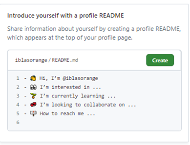

Cela créée automatiquement un fichier **`README.md`** dans un **repository** (considérons cela comme un répertoire, il s'agit en fait d'un dépôt) **du même nom que votre nom utilisateur** dont le contenu est le suivant (vous devez être sur la vue **Edit**).

```markdown

- 👋 Hi, I'm @iblasquez
- 👀 I'm interested in ...
- 🌱 I'm currently learning ...
- 💞️ I'm looking to collaborate on ...
- 📫 How to reach me ...

<!---
iblasquez/iblasquez is a ✨ special ✨ repository because its `README.md` (this file) appears on your GitHub profile.
You can click the Preview link to take a look at your changes.
--->

```

... Continuez avec la [partie 2.c Savoir commiter (*enregistrer*) un README](#2c-savoir-commiter-enregistrer-un-readme) ...

### 2.b Si vous aviez déjà un compte github

- Connectez-vous à votre compte github puis **créez un nouveau dépôt**. Pour cela, cliquez sur **`New repository`** depuis le menu ci-contre obtenu après avoir cliqué sur  **`+`**.

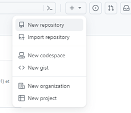

- Comme indiqué ci-dessous, faites en sorte que le nom de votre dépôt (repository) soit strictement identique au nom de votre compte github.

- Puis sélectionnez **`Public`** et **`add a README file`**

- Et terminez par cliquer sur **`Create repository`** pour créer le dépôt.

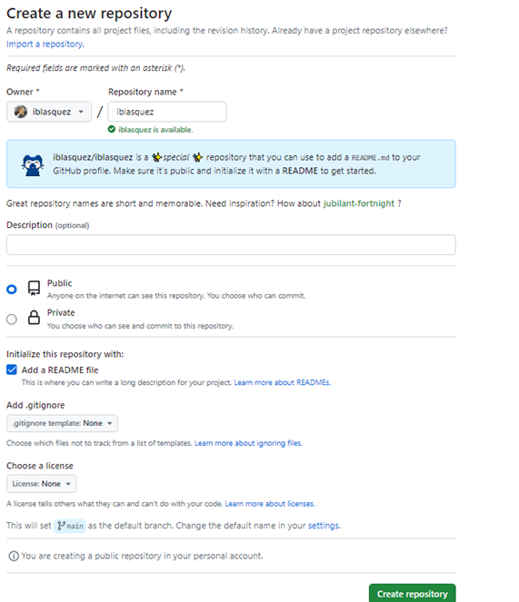

- Un **fichier `README.md`** est alors automatiquement créé dans un **repository**
(un dépôt) **du même nom que votre nom utilisateur**.

- Pour accéder au contenu de ce `README`, cliquez sur le bouton **`Edit README`** pour arriver sur la vue **Edit** qui vous donne le contenu suivant en **Markdown**

```markdown

### Hi there 👋

<!--
**iblasquez/iblasquez** is a ✨ _special_ ✨ repository because its `README.md` (this file) appears on your GitHub profile.

Here are some ideas to get you started:

- 🔭 I'm currently working on ...
- 🌱 I'm currently learning ...
- 👯 I'm looking to collaborate on ...
- 🤔 I'm looking for help with ...
- 💬 Ask me about ...
- 📫 How to reach me: ...
- 😄 Pronouns: ...
- ⚡ Fun fact: ...
-->

```

- Notez bien qu'en markdown **`<!--`** et **`-->`** permettent de mettre du texte en **commentaires**.

- Déplacez la balise de fin de commentaires **`-->`** sur la première phrase de manière à avoir visualiser maintenant le contenu suivant :

```markdown

### Hi there 👋

<!--
**iblasquez/iblasquez** is a ✨ _special_ ✨ repository because its `README.md` (this file) appears on your GitHub profile. 
-->

Here are some ideas to get you started:

- 🔭 I'm currently working on ...
- 🌱 I'm currently learning ...
- 👯 I'm looking to collaborate on ...
- 🤔 I'm looking for help with ...
- 💬 Ask me about ...
- 📫 How to reach me: ...
- 😄 Pronouns: ...
- ⚡ Fun fact: ...


```

... Continuez avec la [partie 2.c Savoir commiter (*enregistrer*) un README](#2c-savoir-commiter-enregistrer-un-readme) ...

### 2.c Savoir commiter (*enregistrer*) un README

- Pour ***enregistrer*** le contenu (et/ou les modifications apportées à ce fichier), vous devrez cliquer sur le bouton  à droite de votre écran :

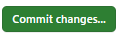

- Pour l'instant, laisser le fichier tel quel et cliquez simplement sur **`Commit changes`**.

> 📢 Le commit est un ***enregistrement*** un peu spécial comme vous le verrez dans le cours sur les gestionnaires de version, qui **doit absolument contenir un message** qui indique ce qui est *commité* 📢

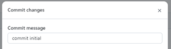

- Habituellement, comme indiqué sur la copie d'écran ci-dessus, pour le **premier commit **on utilise le message commit suivant **`commit initial`** en français ou (**`initial commit`** en anglais) tout dépend si vous souhaitez écrire votre présentation de profil en anglais ou en français 😉

- Une fois le message de commit correctement renseigné, vous pouvez cliquer sur **`Commit changes`**.

## 3. Visualiser le profil de votre compte Github

Votre profil est maintenant visible pour tout internaute arrivant sur votre compte github.  Pour vérifier, rendez-vous sur : **`https://github.com/<votrenomutilisateur>`**

Par exemple, mon profil est visible sur <https://github.com/iblasquez> comme premier contenu de cette page, tout comme le vôtre sur votre page 😉


## 4. Mettre à jour le profil de votre compte Github à la manière d'un portfolio

Pour mettre à jour votre profil, il ne vous reste plus qu'à être créatif et/ou de vous inspirer de profils déjà existants sur github 😉

- Comme par exemple ceux d'(anciens) étudiants de DUT/BUT Informatique :

  - <https://github.com/njacquet87>
  - <http://github.com/GamoTune>
  - <https://github.com/Anton-Hladyshev>
  - <https://github.com/Vexcited>
  - <https://github.com/Rayzeq>
  - <https://github.com/hugoheml>
  - <https://github.com/AzarioCossa>
  - <https://github.com/Axel230303>
  - <https://github.com/fortyup>  
  - <https://github.com/Maksew>
  - <https://github.com/gaiailou>
  - <https://github.com/NeikoStream>
  - <https://github.com/nelpats>
  - <https://github.com/ByrmGkcn>
  - <https://github.com/ThomasBreil>
  - <https://github.com/Anthony-AUDOIN>
  - <https://github.com/FredericCanaud>


- Ou de professionnels :

  - <https://github.com/ythirion>
  - <https://github.com/k33g>
  - <https://github.com/SelimHorri>
  - <https://github.com/anmol098/anmol098>
  - <https://github.com/aatwi>

- et tous ceux que vous trouvez intéressant lors de votre navigation sur github ...

- N'oubliez pas les dépôts github intitulé ***`awesone`*** qui regroupent de nombreux liens vers d'autres dépôts sur une thématique donné.  
Ainsi un dépôt nommé **`awesome-github-profile-readme`** regroupera un certain nombre de liens vers des ressources ou des des readme inspirants.  
C'est le cas par exemple pour le dépôt suivant : <https://github.com/abhisheknaiidu/awesome-github-profile-readme>

- Quant aux ressources pour personnaliser vos profils, vous pouvez :

  - récupérer des icones sur : <https://simpleicons.org/>
  - faire des badges sur : <https://shields.io/>

- Pour approfondir sur le markdown :

  - une présentation rapide du markdown : <https://docs.framasoft.org/fr/grav/markdown.html>
  - une présentation plus détaillée sur la documentation Github en consultant les rubriques suivantes :
    - Prise en main de la rédaction et de la mise en forme sur GitHub : <https://docs.github.com/fr/get-started/writing>
    - Utilisation de la mise en forme avancée : <https://docs.github.com/fr/get-started/writing-on-github/working-with-advanced-formatting>

L'article suivant **Comment se créer un portfolio avec le README GitHub** a des références intéressantes et pourrait également vous aider :  
<https://talks.freelancerepublik.com/comment-se-creer-un-portfolio-avec-le-readme-github/>
